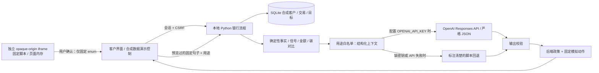

# Demo v2：实现与信任边界

## 技术选择

Python 标准库 HTTP 服务 + SQLite + HTML/CSS/JavaScript。项目为空，目标是第一个可点击、可验证的演示；不用另一个前端服务、打包器或数据库容器。代码、计算和数据边界比引入框架更重要。`http.server` 用于本机演示，不能直接视作生产服务器。



银行建议流程有真实远程模型接口；后端读取密钥，经 HTTPS 向 OpenAI Responses API 发送**用户允许的结构化上下文**，设置 `store: false`，模型返回严格 JSON。浏览器不会拿到密钥。模型响应若无效、拒答或超时会进入标注清楚的脚本回退；后端动作政策不交给模型。明确记录的回复来源见首页和隐私页。根据 [OpenAI 数据控制文档](https://developers.openai.com/api/docs/guides/your-data)，`store: false` 不等于零保留，具体数据处理需按部署安排核实。

`/private.html` 使用 `sandbox="allow-scripts"`（没有 `allow-same-origin`），响应 CSP 设置 `connect-src 'none'`，禁用表单提交。父页面仅接收来自该 iframe、opaque origin 的固定 `APPROVE_MOVING_GOAL` 消息。父页面构建固定的服务端请求，服务端再严格校验允许的原文与用途。**私密沙盒不使用银行侧 OpenAI 连接，也不是本地 LLM 推理。**

## 数据与金额

| 表 | 内容与关系 | 保留/禁止内容 |
| --- | --- | --- |
| customers | id 主键、虚构名称、城市、初始余额 | 合成静态资料；不存预期场景答案 |
| transactions | id 主键、customer_id 外键、日期、类别、整数分 | 合成六个月历史；不存私密对话 |
| events | id 主键、customer_id 外键、日期、指南访问事件 | 仅固定合成事件，无任意自由文本 |
| preferences | customer_id 主键/外键、两个权限、revision | 当前偏好；不存对话或推断私事 |
| goals | customer_id 主键/外键、状态、提醒日期、估算金额、清单、已批准句子 | 单个搬家目标；不存搬家私密理由 |
| decisions | 自增 id、customer_id 外键、日期、固定事件及说明 | 仅模板化操作历史；不存请求/响应或私密文本 |
| travel_scenarios | customer_id 主键/外键、客户演示用的虚构行程假设和保存的选项 | 不把付款记录误认为真实旅行方式；不存真实位置或路线 |

银行流程数据保存到本地 SQLite，客户重置清除其偏好、目标、操作历史与已存的低碳想法。无自动保留期删除。请求捕获按当前页面生成，不保存在数据库；为减少重复付费，OpenAI 解释结果在服务进程内缓存最多 32 个上下文，权限变更时清除。缓存不存原始私密文本。所有 SQLite 语句参数化，连接在事务结束后关闭。

收入为正，支出为负，非收入类别的正数为退款。退款冲减对应类别支出。余额 = 初始余额 + 所有有符号交易。基线仅包含实际存在的月份，不把缺失月份当 0；少于三个基线月不计算家居变化信号。零基线不计算增长倍数。最近月份与参考日期固定，用于可重复演示。

预览 = 当前余额 + 九月收入 − 九月净支出 − 月租 × 押金月数 − 搬家费用。此简单假设包括旧租金，未考虑重叠租金、费用或意外开支。押金月数是可调演示参数，未作当地租赁法规主张。前端展示两位小数，后端计算使用整数分。

低碳选择也由代码计算。演示参数：通勤单程 `6 km`、原定驾车每周五天、替换两天为骑车、四周；买菜原定驾车单程 `4.4 km`、每周一次，示例附近商店骑车单程 `1.2 km`；汽车按**演示假设** `160 g/km`。替换两次通勤的直接汽车排放 = `2 × 6 × 2 × 4 × 160 / 1000 = 15.36 kg`；替换四次买菜汽车行程 = `2 × 4.4 × 4 × 160 / 1000 = 5.632 kg`（展示 `5.63 kg`）。路线、安全、车辆类别、商店存货以及食物生产影响均未验证。研究说明 [本地来源不能单独证明食物更低碳](https://ourworldindata.org/faqs-environmental-impacts-food)。

## 适配器与后端政策

真实发送给 OpenAI 或脚本回退的结构示例（此处省略其他固定 action ID）：

```json
{
  "purpose": "moving_goal_assistance",
  "observed_facts": [{"evidence_id":"rental-guide","kind":"app_activity","event":"rental_guide_view","count":3}],
  "detected_signals": [{"signal_id":"exploratory-interest","basis_evidence_ids":["rental-guide"],"strength":"low","limitation":"Research and spending do not establish intention."}],
  "contradictory_evidence": [{"evidence_id":"no-confirmed-goal","kind":"absence_of_confirmation","finding":"No customer-confirmed goal is recorded. Browsing and spending have other explanations."}],
  "goal_confirmation_status":"unconfirmed",
  "approved_goal":null,
  "candidate_options": [{"id":"DEPOSIT_PLAN","title":"See the deposit plan","deposit_cents":null,"assumption":"Two months of estimated rent; no transaction or offer."}],
  "external_context": [],
  "allowed_action_ids":["CONFIRM_GOAL","PREPARE_DEPOSIT","EXPLORE_CLIMATE","NONE"]
}
```

低碳场景会附上已算出的两个选择和两个明确来源的外部事实。模型负责情境假设、竞争解释、可能的 **WHY**、客户需要、不确定性、简短解释与通知措辞；“WHY” 始终标作假设。它**不计算金额或碳排**。上下文不包含客户 id、姓名、原始交易、浏览原文或私密对话；主动追问除外，追问内容是客户主动发送到银行侧模型的自由文本，页面明确告知这一点。输出必须符合严格 JSON Schema，并在后端再次校验证据 ID、方案 ID、字段长度和动作 ID。[官方结构化输出说明](https://developers.openai.com/api/docs/guides/structured-outputs)。字段权限在构造输入时执行，不靠模型提示词。模型提案不能授权资金、改变客户身份或跳过确认。

| action_id | UI 目的地 | 执行约束 |
| --- | --- | --- |
| CONFIRM_GOAL | 内部 `/journey` 视图 | 客户显式确认 |
| PREPARE_DEPOSIT | 内部 `/tasks/rental-deposit` 视图 | 已确认目标；完成需三个检查项 |
| EXPLORE_CLIMATE | 内部 `/climate` 视图 | 只比较代码已算出的选项；保存想法无真实出行操作 |
| NONE | 无 | 不派发动作 |

这些是前端内部视图标识，不是真实银行 deep link，也不是独立 HTTP 页面。

后端先处理已撤回/已完成目标，然后处理未到期延后、已确认目标、仅有线索、无证据，分别产生 `NO_ACTION / DEFER / HELP_NOW / ASK`；低碳场景有权限线索时产生 `SUGGEST`，同时保持目标未确认。无论提案如何，未确认的搬家目标不能直接执行准备动作。无效输出或异常模型调用产生可见的脚本回退；非法行动仍由后端拒绝。

## 权限与身份

会话 cookie 为 HttpOnly、SameSite=Strict；写请求检查 Origin 和 CSRF；Host 只允许本机服务域名。客户路径拒绝 caller-supplied customer_id。`/api/demo/select` 有意作为演示管理员控制；这个便利入口不是生产身份验证。

请求与权限更新在进程锁下顺序执行。OpenAI 请求同步等待，最多 12 秒；无后台队列或异步派发。撤回后清空解释缓存，新请求重新构建事实与 payload，不再包含撤回字段。已确认目标属于客户自己提交的信息，不依赖推断权限，任务可继续。已返回其他浏览器页面的旧内容不会主动撤回；不声称追回已传送内容。未来接异步模型时必须在实际派发时重新检查 revision，并失效队列和派生缓存。

## 尚未实现

真正的个人设备本地 LLM、生产登录、银行 API、支付、真实消息推送、银行员工转接、生产保留期、百万用户规模和性能验证均未实现。生产演进应采用明确客户身份、按客户分区的状态、批量事件汇总、独立异步派发、权限版本复核及模型调用成本限额；这些不是本 demo 已有的保证。
